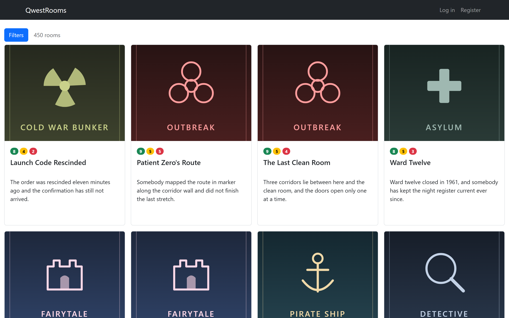
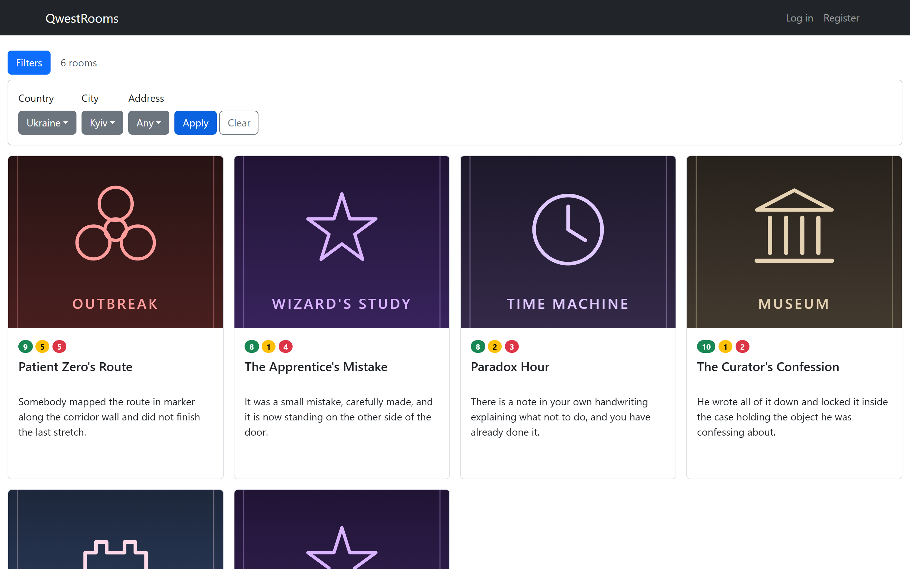
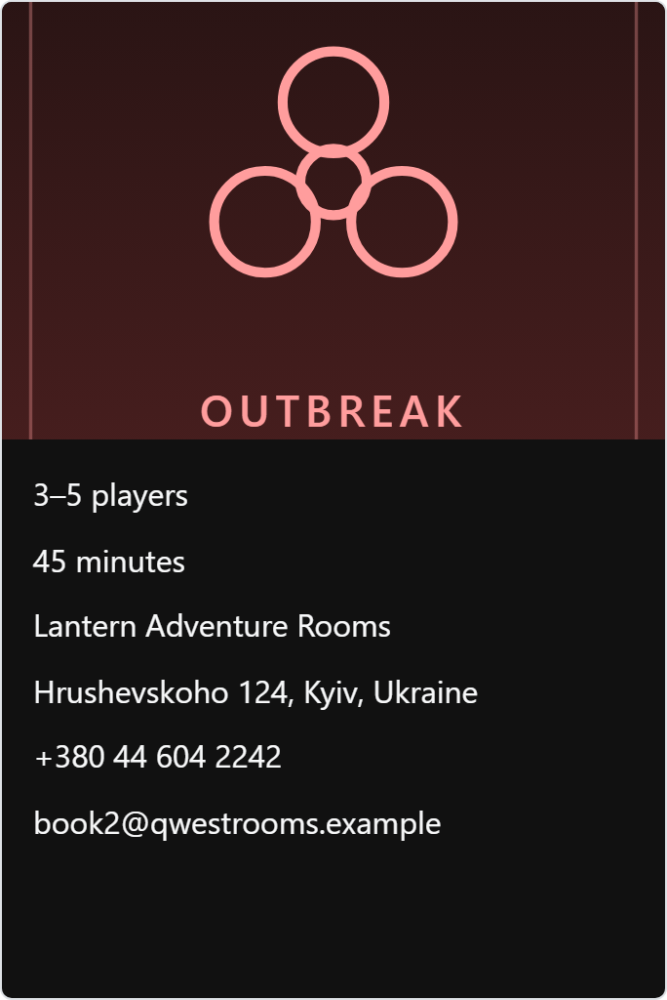
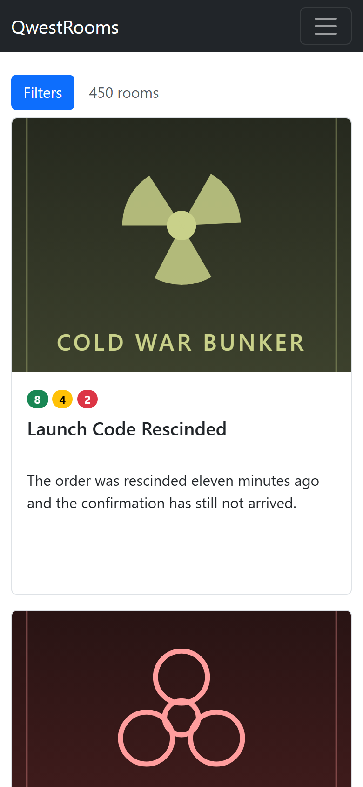

# QwestRooms

[](https://github.com/Dimitriuses/QwestRooms/actions/workflows/build.yml)
[](https://dotnet.microsoft.com/download/dotnet/8.0)
[](LICENSE)

A catalogue of escape-quest rooms: 450 rooms across 15 countries, paged 27 at a time, with a
cascading country → city → address filter. ASP.NET Core MVC over Entity Framework Core and SQLite,
in three layers, with the data-access boundary as the thing worth reading.



Clone it and run `dotnet run --project src/QwestRooms.UI`. There is nothing to install and nothing
to configure: the database is a file the application creates and seeds on first start.

## Features

- **Paged catalogue** of 450 seeded rooms, 27 to a page, as cards that flip to show party size,
  duration, operator and address.
- **Cascading filter** — pick a country, then one of its cities, then a specific address. Each
  level offers only the values that are actually reachable from the previous choice.
- **Filtering and paging compose.** The criteria live in the query string, so a filtered list can
  be paged through, linked to, bookmarked and opened in two tabs with two different filters.
- **Accounts** — registration, sign-in and sign-out on ASP.NET Core Identity, with anti-forgery
  protection, lockout after five failed attempts and server-side validation.
- **Two queries per page**, whatever the size of the catalogue. That is the part of this repository
  with a story behind it — see [Two queries, not 1,072](#two-queries-not-1072).

<p>
  
  
  
</p>

*Every screenshot here is captured by `tools/capture-screenshots.js`, which starts the application,
drives it in a browser and fails if the page reports an error, a failed request, or any horizontal
overflow at 390px. Nothing is staged or hand-cropped.*

## Status and history

I wrote the first version in 2019 while learning ASP.NET MVC and layered application design. It was
a university-era project: ASP.NET MVC 5 on .NET Framework 4.6.1, Entity Framework 6, SQL Server
LocalDB, business logic in the controller, and a repository that read whole tables into memory.

It has been rebuilt twice since, and the README is candid about both passes because reading your own
old code critically is most of what the exercise is for:

| | |
| --- | --- |
| **2019** | Did not build on any machine that had not been set up for it, did not serve `/`, and had no tests. |
| **2026, first pass** | Retargeted to .NET Framework 4.8, made to build and run, business logic moved out of the controller, filtering and paging rewritten as database queries, seed data regenerated, first tests and CI. |
| **2026, second pass (this one)** | Ported to ASP.NET Core 8 and EF Core 8 on SQLite, restructured into `src/` and `tests/`, 63 tests including regression tests that pin the query counts, CI on Windows and Linux, and a CI job that starts the real site and exercises it. |

Both earlier states are preserved and reachable, so every claim below can be checked against the
code rather than taken on trust: `v0.1-original` tags the last 2019 commit, and the `cleanup`
branch holds the first 2026 pass as it was merged.

```bash
git show v0.1-original:QwestRooms.DAL/Repository/GenericRepository.cs   # the defect, as written
```

## Two queries, not 1,072

The 2019 repository handed callers `DbSet.AsEnumerable()`:

```csharp
public IEnumerable<TEntity> GetAll()
{
    return context.Set<TEntity>().AsEnumerable();      // executes SELECT * FROM Rooms, right here
}
```

That one word decides everything downstream. The query runs immediately and returns a list, so the
filtering, sorting and paging the caller then applies all happen in memory over rows that have
already crossed the wire. Worse, the service built its DTOs by walking each row's relationships —
`item.Company.Name`, `item.Adress.Country.Name`, `item.Images` — and with EF6 lazy loading every one
of those was another round trip.

**Measured, not estimated.** The 2019 data-access code was run against the current 450-room dataset
on its own stack — EF6 and SQL Server LocalDB — with an `IDbCommandInterceptor` counting commands:

| Rendering page 1 of the catalogue (27 rooms) | 2019 | Now |
| --- | ---: | ---: |
| SQL commands | **1,072** | **2** |
| Wall clock | ~700 ms | ~70 ms |
| Rows read to show 27 | 450 rooms + every related row | 27 rooms |
| Cost of adding a 451st room | one more query | none |

The 1,072 is not a round number, and it decomposes exactly:

```
    1  SELECT * FROM Rooms            all 450 of them, to display 27
  450  one Images query per room
  450  one Address query per room
   69  one City query per distinct city          EF's identity map spares the repeats
   69  one Street query per distinct street
   18  one Company query per distinct company
   15  one Country query per distinct country
-----
 1072
```

### The fix

The repository returns a composable query instead of a finished list, and the mapping is an
expression tree rather than a loop, so filtering, ordering, paging and mapping all become part of
one statement:

```csharp
public IQueryable<TEntity> Query() => _context.Set<TEntity>().AsNoTracking();
```

```csharp
var query = ApplyFilter(_roomRepository.Query(), filter);
var totalCount = await _roomRepository.CountAsync(query, cancellationToken);   // query 1

var page = query
    .OrderBy(room => room.Id)
    .Skip((pageNumber - 1) * pageSize)
    .Take(pageSize)
    .Select(Projections.ToRoomDto);                                            // query 2
```

Two supporting decisions keep it fixed rather than fixed-for-now:

- **Lazy loading is not enabled and no navigation property is `virtual`.** A navigation that was
  not projected now comes back null instead of quietly issuing another query. The failure mode of a
  mistake is a visible bug rather than an invisible cost.
- **The business layer never sees Entity Framework.** `ToListAsync` and `CountAsync` are the
  repository's job, so a service cannot accidentally execute a query it meant to compose.

### How it is pinned

`tests/QwestRooms.Tests/QueryCountTests.cs` counts the SQL a page costs, using a
`DbCommandInterceptor` over a real SQLite database:

```
Catalogue_FirstPageOf450Rooms_ExecutesExactlyTwoQueries
Catalogue_FilteredByCountry_ExecutesExactlyTwoQueries
Catalogue_LastPage_ExecutesExactlyTwoQueries
Catalogue_QueryCount_DoesNotGrowWithTheCatalogue
Catalogue_FirstPage_AsksTheDatabaseForOnlyOnePage
Catalogue_Filtered_SendsTheFilterAsAWhereClause
LegacyPattern_ReadEverythingThenWalkNavigations_CostsHundredsOfQueries
```

The last one is the 2019 access pattern, reproduced against the same dataset so the comparison is
something the suite measures rather than something this file asserts. It reports **1,072** — the
same number the EF6 measurement gave, because the count is a property of the access pattern, not of
the provider.

These were checked by breaking the fix on purpose and watching them go red. Putting the 2019
`ToList()` back into the repository fails **34 of the 63** tests — every query-count test and every
endpoint test — with `The provider for the source 'IQueryable' doesn't implement
'IAsyncQueryProvider'`, which is the modern stack refusing to run the old pattern rather than
quietly degrading to it. Adding one extra `CountAsync` call fails exactly the **four** tests that
assert a number, which is what shows the counter itself is doing the work.

## Getting started

Requirements: the [.NET 8 SDK](https://dotnet.microsoft.com/download/dotnet/8.0). Nothing else — no
database server, no Windows.

```bash
git clone https://github.com/Dimitriuses/QwestRooms.git
cd QwestRooms

dotnet run --project src/QwestRooms.UI        # http://localhost:5188
```

Or through the helper, which VS Code also drives as tasks
(<kbd>Ctrl</kbd>+<kbd>Shift</kbd>+<kbd>P</kbd> → *Run Task*):

```powershell
./tools/dev.ps1 build
./tools/dev.ps1 test
./tools/dev.ps1 run
./tools/dev.ps1 reseed        # delete the local database so the next run reloads the seed data
./tools/dev.ps1 screenshots   # start the site, drive it in a browser, rewrite docs/images
```

### The database

`qwestrooms.db` is a SQLite file created next to the application on first start. Startup applies
the EF Core migrations and, if the catalogue is empty, loads the demo dataset — 15 countries, 69
cities, 69 streets, 18 companies, 450 addresses, 450 rooms and 450 posters — from the SQL scripts
embedded in `QwestRooms.DAL`.

The dataset is produced by `tools/generate-seed.ps1` from a fixed random seed, artwork included, so
re-running it reproduces the same catalogue. Edit the geography or theme tables at the top of that
script to produce a different one.

Schema changes go through migrations. `dotnet-ef` is pinned as a local tool, so no global install is
needed:

```bash
dotnet tool restore
dotnet dotnet-ef migrations add SomeChange --project src/QwestRooms.DAL
```

To watch the queries this README is about, run in the Development environment and read the log:
`appsettings.Development.json` turns `Microsoft.EntityFrameworkCore.Database.Command` up to
`Information`, so every statement is printed. Loading the catalogue page prints three
`Executed DbCommand` lines: two for the grid, one for the country list in the filter.

## Tests

```
dotnet test QwestRooms.sln
```

63 tests, in four groups:

- **Query counts** — the regression tests above.
- **Services** — the filter rules, the paging arithmetic, the projections, the de-duplication of
  filter options.
- **Seed data** — that the demo dataset is coherent: every city belongs to exactly one country,
  every score is in the range the cards imply, no country lists the same room twice, and every
  poster path resolves to a file this repository ships.
- **Endpoints** — the real application started in-process: routing, Razor, static files,
  registration, sign-in, anti-forgery, and that a filtered second page really contains three rooms.

They run against a real SQLite database rather than a mocked repository, deliberately. The property
most of them are about is that queries are *translated to SQL*, and a mock cannot tell you that:
LINQ to Objects will happily execute a query no database could, which is exactly the mistake the
2019 code made.

## Continuous integration

`.github/workflows/build.yml` builds and tests on `windows-latest` **and** `ubuntu-latest`, at zero
warnings (`TreatWarningsAsErrors` is on for every project). A third job then publishes the site,
starts it on Linux, and drives it with `curl`: it waits for the database to be created and seeded,
checks that the catalogue serves 27 cards, that a filtered second page serves 3 of Ukraine's 30
rooms, and that the cascading filter offers Kyiv once and no Polish city at all.

That job exists because "it is cross-platform now" is otherwise just a claim. The 2019 project could
only ever run on Windows: it needed IIS Express and a SQL Server LocalDB instance.

## Layout

```
src/QwestRooms.DAL      entities, RoomsContext, migrations, the repository, the seed scripts
src/QwestRooms.BLL      services, DTOs, filter criteria, paging, the projection expressions
src/QwestRooms.UI       ASP.NET Core MVC: controllers, Razor views, wwwroot, Identity wiring
tests/QwestRooms.Tests  xUnit: query counts, services, seed data, endpoints
tools/                  dev.ps1, the seed generator, the screenshot capture
```

Dependencies point inward from the UI. `QwestRooms.BLL` holds what a filter means, how paging works
and how an entity becomes a DTO; `QwestRooms.UI` binds query-string criteria, calls a service and
renders. No business logic lives in a controller — in 2019 about seventy lines of it did, as three
near-identical branches of nested loops, with the selection kept in `Session`.

## Known limitations

Real ones, listed because a reviewer will find them anyway:

- **The catalogue is read-only.** There is no create, edit or delete for rooms. The repository
  exposes only the query methods the application actually uses.
- **Nothing is access-controlled.** Accounts work end to end, but no page requires being signed in,
  so authentication is demonstrated rather than used.
- **SQLite only.** The provider is a one-line change in `Program.cs`, but the migrations are
  scaffolded for SQLite and only SQLite is tested, so calling it database-agnostic would be a
  stretch.
- **Validation is server-side only.** Removing jQuery took jQuery Unobtrusive Validation with it, so
  a bad password is caught by the server rather than by the browser. Correct, but a round trip
  slower than it needs to be.
- **The filter needs JavaScript.** The pager degrades to ordinary links, the filter does not.
- **A generic repository over EF Core is arguably redundant** — `DbContext` is already a unit of
  work, and query objects would carry the same weight with less indirection. It is kept because the
  layer boundary is the thing this project is demonstrating, and because the return type of one
  method on it is the whole story above.
- **The seed data is invented.** The countries, cities and streets are real and correctly paired;
  the rooms, companies, contact details and posters are generated by `tools/generate-seed.ps1`.
- **Room concepts repeat across countries.** There are 80 distinct rooms spread over 450 listings,
  as an escape-room chain's would be. No country, and therefore no filtered page, lists the same
  room twice.
- **No search, no sorting, no room detail page.** You can narrow by place and page through; that is
  all.
- **Nothing here is production hardening.** No rate limiting, no email confirmation, no two-factor,
  no secrets management — it is a portfolio project, not a deployment.

`Qwest` in the name is a play on "quest", and is kept because it is the repository's name.

## License

[MIT](LICENSE). Bootstrap 5.3.3 is bundled under `src/QwestRooms.UI/wwwroot/lib/bootstrap` with its
own MIT licence alongside it.
